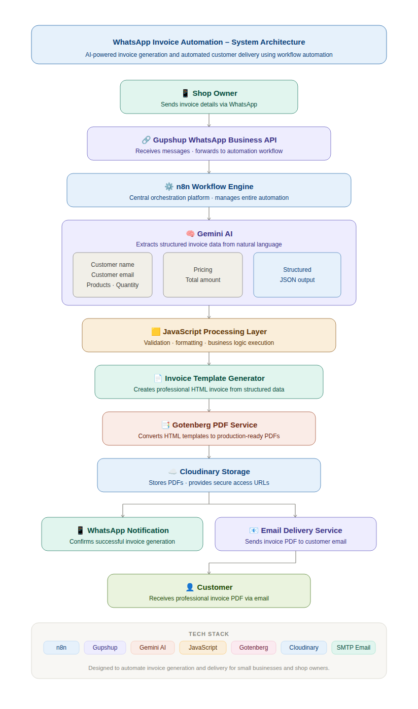
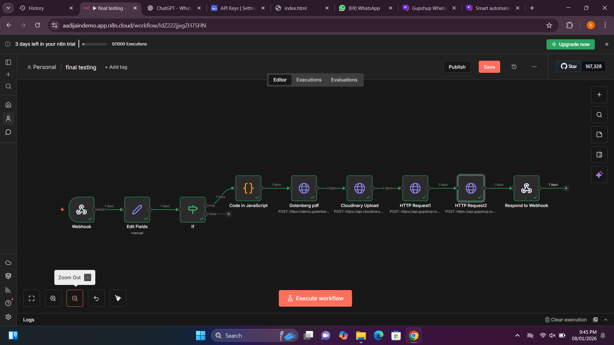
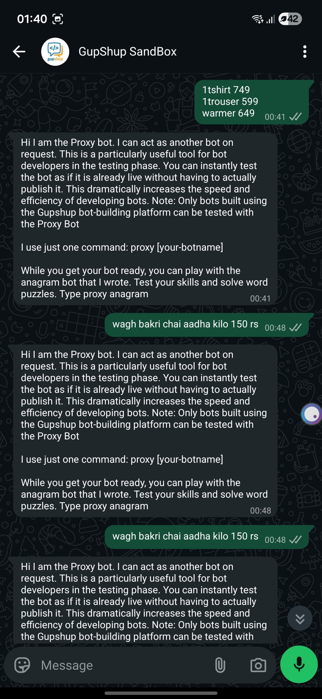
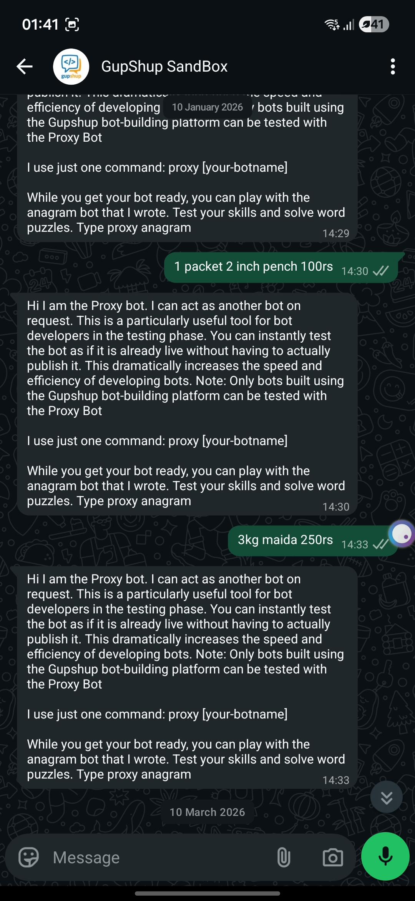
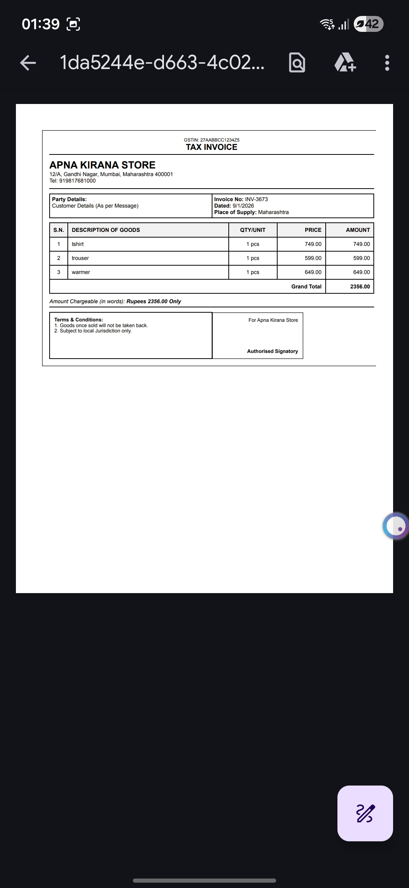
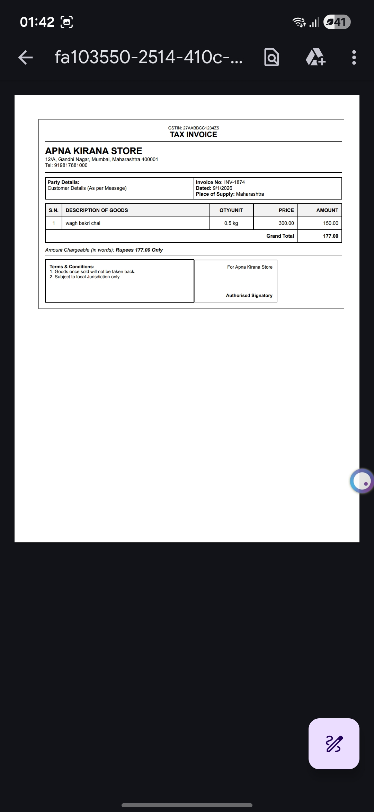

# WhatsApp Invoice Automation

> Transforming WhatsApp into an AI-powered invoicing assistant for small businesses.



---

## 🚀 Overview

WhatsApp Invoice Automation is an end-to-end business process automation system that enables shop owners and small businesses to generate professional PDF invoices directly from WhatsApp messages.

Instead of manually creating invoices, formatting PDFs, uploading files, and sending emails, a business owner simply sends product details through WhatsApp. The system automatically processes the request, generates a PDF invoice, stores it securely, and delivers it to the customer via email.

The entire workflow is orchestrated using n8n and integrates multiple services including Gupshup, Gemini AI, Gotenberg, Cloudinary, and Email APIs.

---

## 🎯 Problem Statement

Small businesses frequently face challenges such as:

* Manual invoice creation
* Repetitive administrative work
* Human errors during billing
* Delayed invoice delivery
* Lack of affordable automation tools
* Complex billing software

For local stores and service providers, these inefficiencies reduce productivity and consume valuable business time.

---

## 💡 Solution

This project transforms WhatsApp into an intelligent invoice generation platform.

A business owner can send a simple message such as:

```text
1 T-Shirt ₹749
1 Trouser ₹599
1 Warmer ₹649
```

The system automatically:

1. Receives the WhatsApp message
2. Processes invoice information
3. Extracts structured billing data using AI
4. Generates a professional invoice template
5. Converts the invoice into PDF format
6. Uploads the PDF to cloud storage
7. Delivers the invoice through email
8. Sends workflow completion updates

The entire process completes without manual intervention.

---

## ✨ Key Features

### 📱 WhatsApp-Based Invoice Creation

Generate invoices directly through WhatsApp messages.

### 🧠 AI-Assisted Processing

Gemini AI helps process and structure invoice information received in natural language format.

### 📄 Automated PDF Generation

Invoices are automatically converted into professional PDF documents using Gotenberg.

### ☁️ Cloud Storage Integration

Generated PDFs are securely uploaded and stored through Cloudinary.

### 📧 Automated Email Delivery

Invoices are automatically delivered to customers via email.

### ⚙️ Workflow Automation

The entire process is orchestrated through n8n workflows.

### 🚀 Minimal Human Intervention

Reduces manual work and improves operational efficiency.

---

## 🏗 System Architecture


---

## ⚙ Workflow

```text
Shop Owner (WhatsApp)
        │
        ▼
Gupshup WhatsApp API
        │
        ▼
n8n Workflow Engine
        │
        ▼
Gemini AI Processing
        │
        ▼
JavaScript Validation & Processing
        │
        ▼
Invoice Template Generation
        │
        ▼
Gotenberg PDF Generation
        │
        ▼
Cloudinary Storage
        │
        ▼
Email Delivery
        │
        ▼
Customer
```

---

## 🔄 Workflow Preview

The automation workflow was built using n8n and integrates invoice processing, PDF generation, cloud storage, and automated delivery.



---

## 📱 WhatsApp Input

The shop owner sends invoice details directly through WhatsApp.





---

## 📄 Generated Invoice

The workflow automatically generates professional PDF invoices.






---

## 📧 Automated Email Delivery

After invoice generation, the PDF is automatically sent to the customer through email.


---

## 🛠 Technology Stack

| Category                | Technology           |
| ----------------------- | -------------------- |
| Workflow Automation     | n8n                  |
| Messaging Platform      | Gupshup WhatsApp API |
| Artificial Intelligence | Gemini AI            |
| Data Processing         | JavaScript           |
| PDF Generation          | Gotenberg            |
| Cloud Storage           | Cloudinary           |
| Email Delivery          | SMTP / Gmail         |
| Communication           | WhatsApp             |

---

## 📈 Business Impact

### Before Automation

* Receive order details
* Create invoice manually
* Format invoice
* Export PDF
* Upload file
* Compose email
* Send invoice

### After Automation

* Send WhatsApp message

That's it.

Everything else is handled automatically.

---

## 🎯 Real World Use Cases

### Retail Stores

Generate invoices directly from WhatsApp orders.

### Hardware Shops

Quick invoice creation for customer purchases.

### Kirana Stores

Automated billing for daily transactions.

### Freelancers

Generate and deliver invoices without billing software.

### Service Providers

Automate billing and invoice distribution.

---

## 🧠 Skills Demonstrated

* Workflow Automation
* Business Process Automation
* AI Integration
* API Integration
* PDF Generation
* Cloud Storage
* Email Automation
* JavaScript Development
* Webhook Handling
* System Integration
* Low-Code Development

---

## 📌 Project Highlights

* End-to-end invoice automation workflow
* Real-world business use case
* WhatsApp-based user experience
* AI-assisted invoice processing
* Automated PDF generation
* Cloud-hosted document delivery
* Professional workflow orchestration using n8n

---

## 📌 Project Status

This project was originally developed and demonstrated during a cloud-hosted trial environment using n8n and third-party services.

The original deployed workflow is no longer active because the trial infrastructure and associated temporary services have expired.

However, the complete system architecture, workflow design, implementation approach, screenshots, and demonstration outputs have been preserved in this repository.

The solution can be recreated and redeployed using the same technology stack:

* n8n
* Gupshup WhatsApp API
* Gemini AI
* Gotenberg
* Cloudinary
* SMTP / Gmail

This repository serves as a portfolio showcase of the architecture, automation workflow, and business process implementation developed during the project.

**Note:** The screenshots included in this repository were captured from successful executions of the original workflow during the development and testing phase.

---

## 👨‍💻 Author

**Aadi Jain**

B.Tech Student | Software Development Enthusiast

Built to simplify invoice generation for small businesses using workflow automation and AI-powered processing.
